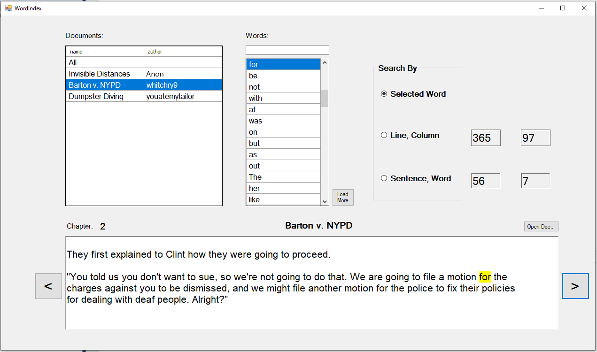
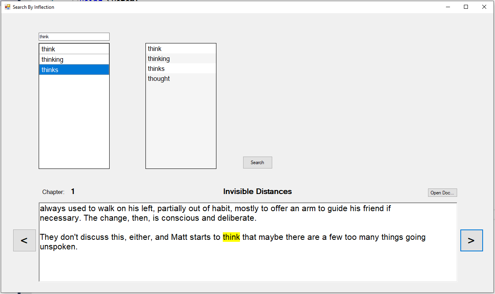

# Concordance-Project
 A text indexing system for textual analysis and statistical information of short stories.

The system parses given text files and stores their words and symbols in the database, along with other relevant information such as location in file and base form of the word.
After storing, we can look up word/phrase appearances across all files and see them in context - without relying on the original text files - as well as get statistical information.

Allows to search for word instances accross all files:

Allows to search for all word instances by inflection:

Get statistical information:

